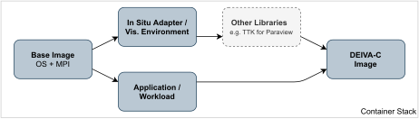

# EZISAV: Developing and Evaluating In Situ Visualization Algorithms using Containers

Creating in situ pipelines can be complicated and time-consuming and is therefore often evaded by researchers.
Due to this, new visualization techniques are often not evaluated sufficiently.
We present EZISAV, a collection of layered Docker containers encapsulating several pipelines for multiple in situ frameworks in a ready to use package, which are thus quickly operational.
Designed for portability and ease of use, these containers provide proof of concept examples.

Our containers are available from a container registry, but we also provide the container recipes used to build them and guidance on how to apply customization.
We hope that these pipelines can serve the community well by reducing the time needed for setting up workflows and integrating in situ capabilities into simulations.

## Conceptual Layout

Our presented infrastructure is comprised of several layered containers consisting of a base image, a visualization environment, the application itself, optionally additional layers for additional libraries, and finally the finished image as the top layer.

The base image mostly contains the bare OS, the MPI implementation used and other general dependencies. The simulation container is built on top of the base image and contains the desired workload. The visualization environment also contains the in situ infrastructure used. In our example workflows, these are [ParaView Catalyst](https://www.paraview.org/in-situ/) and [Ascent](https://github.com/Alpine-DAV/ascent). 

ParaView is a data analysis and visualization tool based on the Visualization Toolkit (VTK), a software suite for the manipulation and visualization of scientific data. It contains an in situ suite called Catalyst which allows for live visualization as the simulation is running. 

Ascent is part of ALPINE, a data visualization project which is part of the Department of Energy's Exascale Computing Project.
Ascent itself is a many-core capable in situ visualization tool whose main design goals are supporting a diverse set of simulations, ease of use and resource minimization on the host.

Additional container layers can be integrated, e.g.to include additional libraries, such as the [Topology ToolKit (TTK)](https://topology-tool-kit.github.io/), for topological data analysis.

Finally, the top layer uses multi-stage container builds to merge the visualization and the simulation containers into our final, in situ capable, container.
<figure>
    
    <figcaption> Overview over the container infrastructure proposed.</figcaption>
</figure>

## Conclusion

Currently, visualization of petascale and exascale data is not restricted by processing power but by storage speed and size. 
In situ visualization aims to improve this, by creating visualization artifacts which can be explored post hoc.
Several different infrastructures for in situ visualization exist, each with their own design goals.
However, integrating these infrastructures into existing simulations, either via existing in situ adaptors or by creating one yourself, can be tiresome and requires a deep investment into a multitude of libraries and dependencies.
Thus, new visualization techniques may not receive the proper validation and evaluation.

We present EZISAV, a set of workflows which aims to alleviate this problem. 
It consists of multiple containers building two different in situ frameworks, showcasing examples for them.
We provide these workflows as an open repository with instructions on how to work with them.
The images themselves are publicly available via Docker Hub, but even more importantly, we also provide the Dockerfiles and all files used for building these images.
Included with the image files are instructions on how to modify (e.g. to change the ParaView pipeline) and how to rebuild the container.
This allows for quicker prototyping and can even be used in HPC environments to make use of large-scale parallelism, which is supported in many simulation codes.

Using the EZISAV examples, the time spent on setting up lengthy workflows and integrating in situ visualization into simulations can instead be used for additional validation and evaluation. 
Nevertheless, there are still improvements which can make the repository more useful to scientists.
The most prominent way which we can improve our collection of workflows is by simply expanding it. 
While we provide an open repository presenting multiple different use-cases, this collection is certainly not a complete one.
Encapsulating other workflows based on different simulations, such as PHASTA or MPAS-O, which are maybe even based on different architectures, such as GPU based simulations, or even different frameworks, would increase the usefulness.
