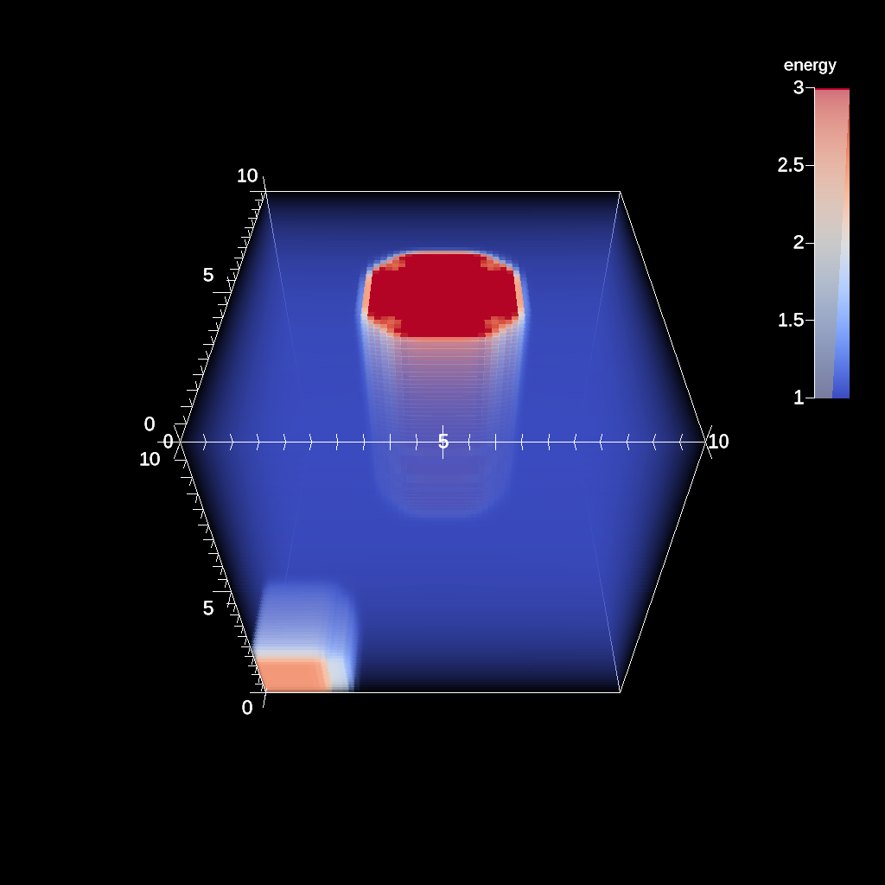
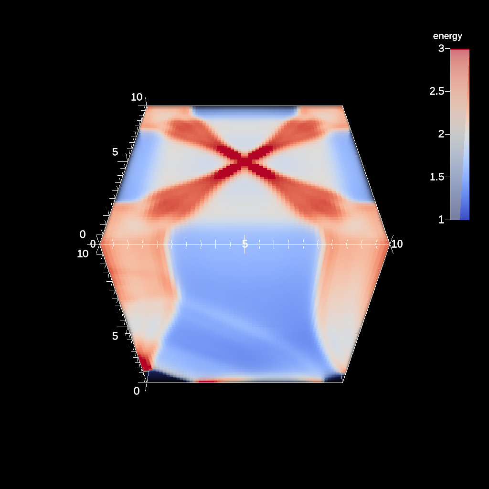
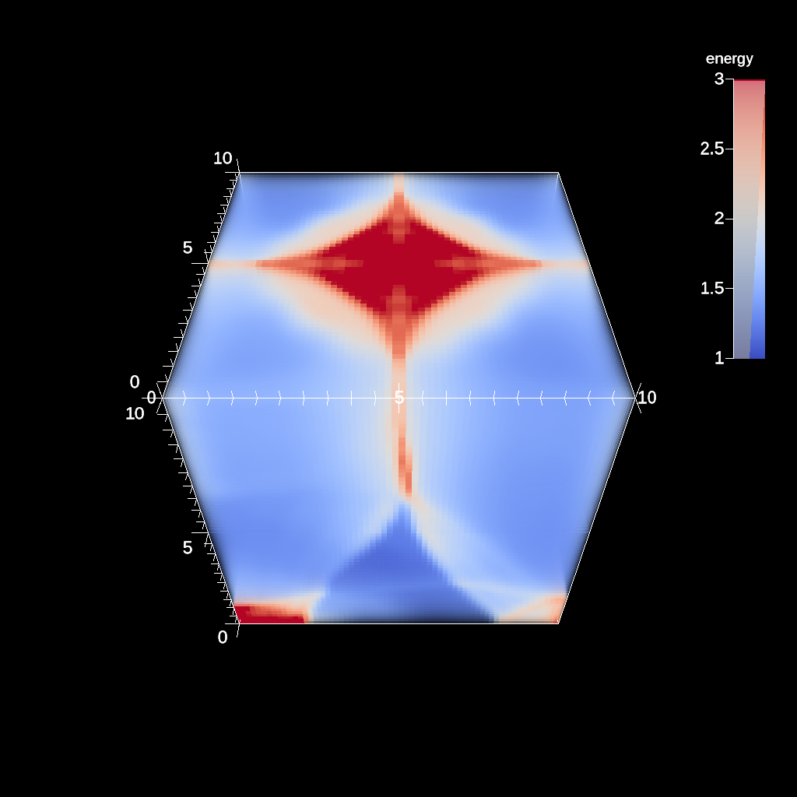
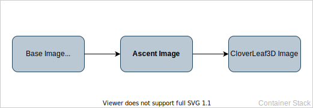
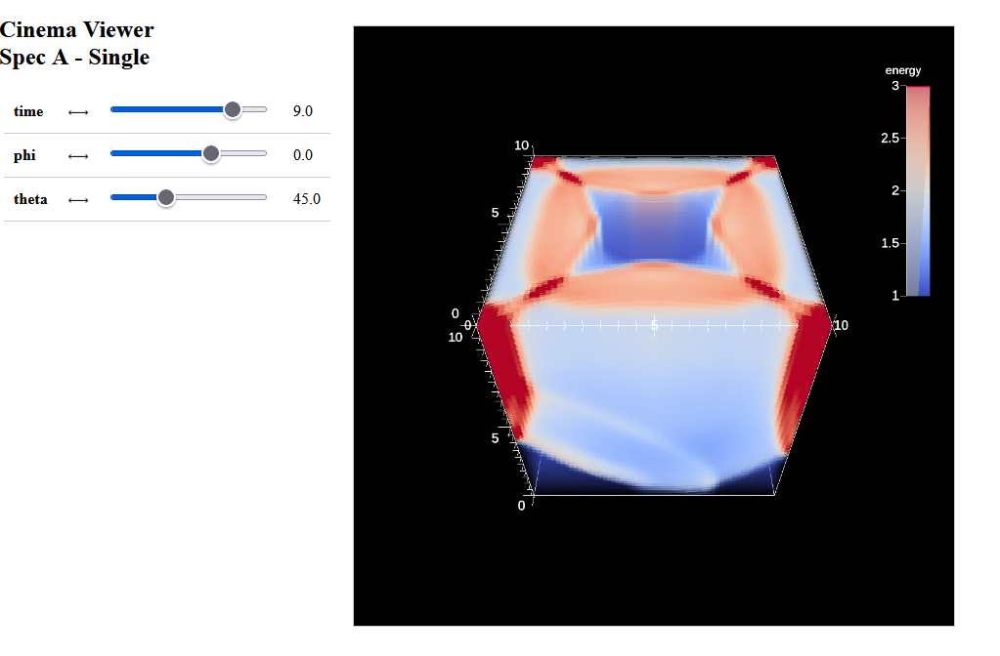

# Ascent + CloverLeaf3d

[Ascent](https://ascent.readthedocs.io/en/latest/) is part of ALPINE, a data visualization project which is part of the Department of Energy’s Exascale Computing Project. Ascent itself is a many-core capable in situ visualization tool whose main design goals are supporting a diverse set of simulations, ease of use and resource minimization on the host.

[CloverLeaf3D](http://uk-mac.github.io/CloverLeaf3D/) is a 3D implementation of the CloverLeaf mini-app, a hydrodynamics benchmark. CloverLeaf solves the compressible Euler equations on a Cartesian grid, using an explicit, second-order accurate method. It uses a staggered grid in which the cells’ centers store energy, density and pressure while the cell corners store the velocity. 
<table>
    <tr>
        <td>
            <figure>
                
                <figcaption>Energy level of the grid at the beginning.</figcaption>
            </figure>
        </td>
        <td>
            <figure>
                
                <figcaption>Energy level of the grid after timestep 6.</figcaption>
            </figure>
        </td>
    </tr>
    <tr>
        <td>
            <figure>
                
                <figcaption>Energy level of the grid after timestep 12.</figcaption>
            </figure>
        </td>
        <td>
            <figure>
                
                <figcaption>Energy level of the grid after timestep 18.</figcaption>
            </figure>
        </td>
    </tr>
</table>

## Build instructions
The CloverLeaf3D container depends on the Ascent container, which in turn relies on the Base container, as seen in the following figure. Therefore those two containers need to be built beforehand with the correct tags. The commands for this are found in [build-clover.sh](https://github.com/scivislab/deiva-c/blob/main/build-clover.sh).
<figure>
    
    <figcaption> Overview over the container layout for Ascent and CloverLeaf3D.</figcaption>
</figure>

### Customization
The Ascent actions, and therefore the visualization for the resulting data, can be changed by editing [ascent_actions.yaml](https://github.com/scivislab/deiva-c/blob/main/clover/inputs/ascent/ascent_actions.yaml). More information on Ascent actions can be found [here](https://ascent.readthedocs.io/en/latest/Actions/index.html). When finished with the customization, the container can be rebuilt by navigating into the `clover` directory and executing:

```bash
docker build -t deivac/clover -f Dockerfile.clover .
```

The CloverLeaf3D simulation is being run during container creation and provides a Cinema database.

## Running the container
After either pulling or building the container, it can be run by calling:

```bash
docker run -p 80:80 deivac/clover
```

`-p 80:80` makes port 80 available on the outside which is needed for the Cinema viewer. We can then connect to it by visiting `localhost:80` in our browser.
<figure>
    
    <figcaption> Overview over the Cinema viewer running via nginx in the container.</figcaption>
</figure>