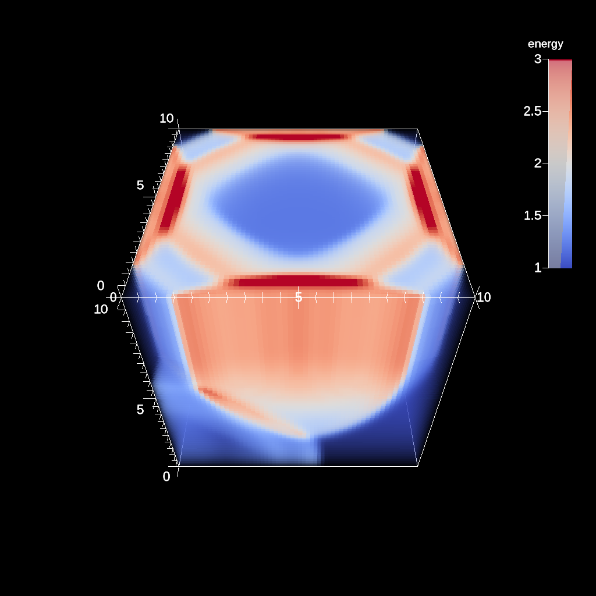

# Ascent + CloverLeaf3d

[Ascent](https://ascent.readthedocs.io/en/latest/) is part of ALPINE, a data visualization project which is part of the Department of Energy’s Exascale Computing Project. Ascent itself is a many-core capable in situ visualization tool whose main design goals are supporting a diverse set of simulations, ease of use and resource minimization on the host.

[CloverLeaf3D](http://uk-mac.github.io/CloverLeaf3D/) is a 3D implementation of the CloverLeaf mini-app, a hydrodynamics benchmark. CloverLeaf solves the compressible Euler equations on a Cartesian grid, using an explicit, second-order accurate method. It uses a staggered grid in which the cells’ centers store energy, density and pressure while the cell corners store the velocity. 
<table>
    <tr>
        <td>
            <figure>
                
                <figcaption>Energy level of the grid at the beginning.</figcaption>
            </figure>
        </td>
        <td>
            <figure>
                
                <figcaption>Energy level of the grid after timestep 6.</figcaption>
            </figure>
        </td>
    </tr>
    <tr>
        <td>
            <figure>
                
                <figcaption>Energy level of the grid after timestep 12.</figcaption>
            </figure>
        </td>
        <td>
            <figure>
                
                <figcaption>Energy level of the grid after timestep 18.</figcaption>
            </figure>
        </td>
    </tr>
</table>