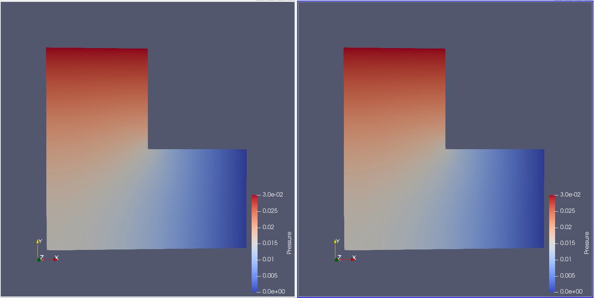
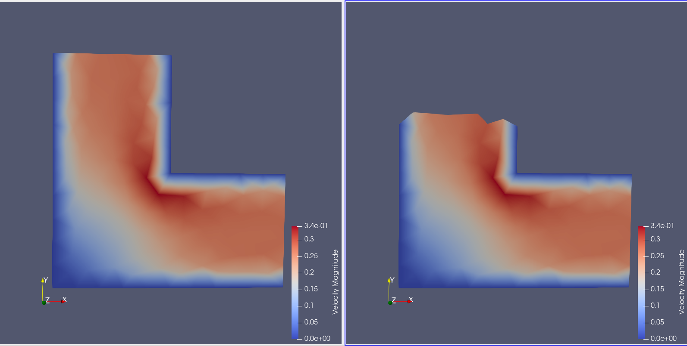
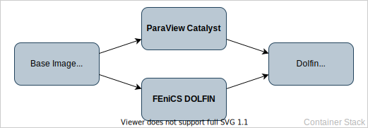

# ParaView Catalyst + FEniCS Dolfin


ParaView is a data analysis and visualization tool based on the Visualization Toolkit(VTK), a software suite for the manipulation and visualization of scientific data.It is, along with VTK and CMake, maintained by Kitware. ParaView contains an in situ suite called Catalyst which allows for live visualization as the simulation is running.

We illustrate the abilities of Catalyst by using the DOLFIN simulation code of the [FEniCS Project](https://fenicsproject.org/), which aims to be an open-source platform for solving partial differential equations. DOLFIN itself is the C++/Python backend, a library providing algorithms for finite element meshes and numerical linear algebra. FEniCS is designed to be easily parallelizable. Simply calling the Python script with `mpirun` will allow it to be executed in parallel, with each component of FEniCS being highly parallelized, if possible.

The DOLFIN part we are using is solving an incompressible Navier-Stokes equation on an L-shaped domain using Chorin's splitting method.
Every part of the problem description can be transcribed into Python using DOLFIN operators.
This example is part of the DOLFIN demo suite, adapted to work for Catalyst.

<table>
    <tr>
        <td>
            <figure>
                
                <figcaption>Pressure of the grid at the beginning.</figcaption>
            </figure>
        </td>
        <td>
            <figure>
                
                <figcaption>Velocity of the grid at the beginning.</figcaption>
            </figure>
        </td>
    </tr>
    <tr>
        <td>
            <figure>
                
                <figcaption>Pressure of the grid after timestep 500.</figcaption>
            </figure>
        </td>
        <td>
            <figure>
                
                <figcaption>Velocity of the grid after timestep 500.</figcaption>
            </figure>
        </td>
    </tr>
    <tr>
        <td>
            <figure>
                
                <figcaption>Pressure of the grid after timestep 1000.</figcaption>
            </figure>
        </td>
        <td>
            <figure>
                
                <figcaption>Velocity of the grid after timestep 1000.</figcaption>
            </figure>
        </td>
    </tr>
</table>


## Build instructions
The Catalyst container depends on the ParaView and on the FEniCS DOLFIN container, which in turn relies on the Base container, as seen in the following figure. Therefore those two containers need to be built beforehand with the correct tags. The commands for this are found in [build-catalyst.sh](https://github.com/scivislab/deiva-c/blob/main/build-catalyst.sh).
<figure>
    
    <figcaption> Overview over the container layout for ParaView Catalyst and FEniCS DOLFIN.</figcaption>
</figure>


### Customization
The container is able to run one of two workloads: a simple proof of concept grid in which the simulation consists of the velocity values being updated according to the current timestep and the aforementioned DOLFIN simulation. The ParaView visualization for the data received is controlled via [Catalyst pipeline scripts](https://blog.kitware.com/anatomy-of-a-paraview-catalyst-python-script/) and can be customized by adding or removing [filters](https://www.paraview.org/Wiki/ParaView/Users_Guide/List_of_filters#Slice), to interpret the data.
The Catalyst pipelines can be changed by editing [feslicescript.py](https://github.com/scivislab/deiva-c/tree/main/catalyst/Examples/CxxFullExample/SampleScripts/feslicescript.py) for the grid example or [CatalystScriptTest.py](https://github.com/scivislab/deiva-c/tree/main/catalyst/Examples/PythonDolfinExample/CatalystScriptTest.py) for the DOLFIN example. 
When finished with the customization, the container can be rebuilt by navigating into the `catalyst` directory and executing:

```bash
docker build -t ezisav/catalyst -f Dockerfile.catalyst .
```


## Running the container
After either pulling or building the container, it can be run by calling:

```bash
docker run -p 11111:11111 ezisav/catalyst
```

`-p 11111:11111` makes port 11111 available on the outside which is needed for ParaView. We can then connect to ParaView 5.8.0 by opening `File->Connect...` and adding the server `localhost:11111`. Also, connect Catalyst via `Catalyst->Connect...`. The server is now awaiting Catalyst connections. Finally either execute the workload script provided by `start_simulation.sh` by calling

```bash
docker exec -it <containerid> /home/docker/start_simulation.sh
```
or by executing `bash` in the container and navigating to the executables manually. The container id is printed by the ParaView server when starting the container, the executables paths can be found in `start_simulation.sh` and in `/home/docker/paraview/Examples/Catalyst/build/PythonDolfinExample/run-catalyst-step6.sh`.

