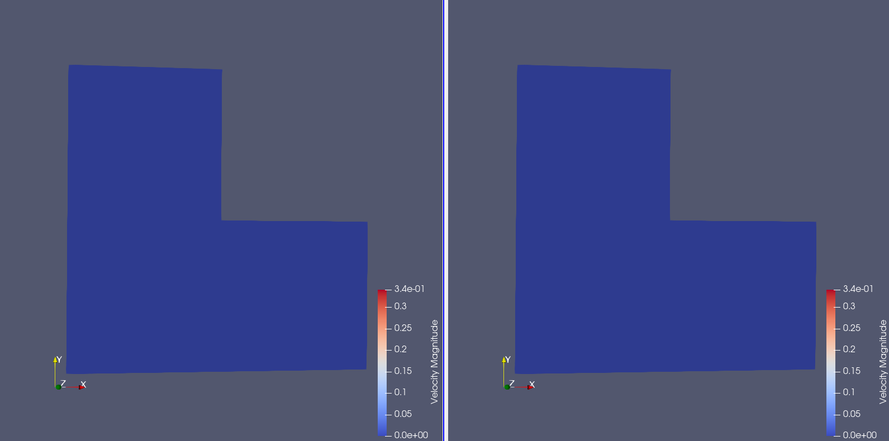
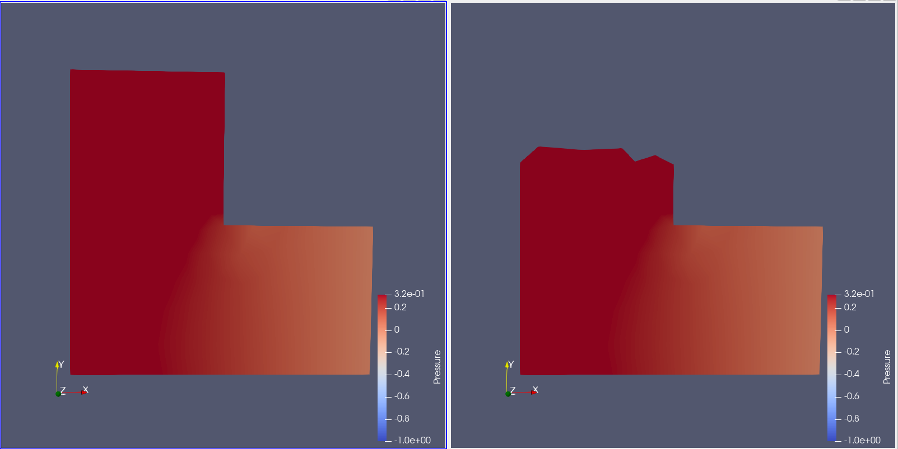
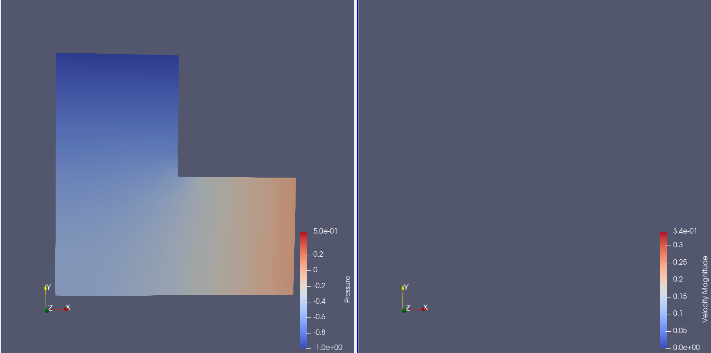
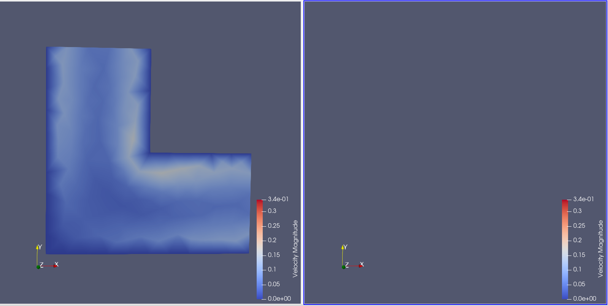

# ParaView Catalyst + FEniCS Dolfin

ParaView is a data analysis and visualization tool based on the Visualization Toolkit(VTK), a software suite for the manipulation and visualization of scientific data.It is, along with VTK and CMake, maintained by Kitware. ParaView contains an in situ suite called Catalyst which allows for live visualization as the simulation is running.

We illustrate the abilities of Catalyst by using the DOLFIN simulation code of the [FEniCS Project](https://fenicsproject.org/), which aims to be an open-source platform for solving partial differential equations. DOLFIN itself is the C++/Python backend, a library providing algorithms for finite element meshes and numerical linear algebra. FEniCS is designed to be easily parallelizable. Simply calling the Python script with \code{mpirun} will allow it to be executed in parallel, with each component of FEniCS being highly parallelized, if possible.

The DOLFIN part we are using is solving an incompressible Navier-Stokes equation on an L-shaped domain using Chorin's splitting method.
Every part of the problem description can be transcribed into Python using DOLFIN operators.
This example is part of the DOLFIN demo suite, adapted to work for Catalyst.

<table>
    <tr>
        <td>
            <figure>
                
                <figcaption>Pressure of the grid at the beginning.</figcaption>
            </figure>
        </td>
        <td>
            <figure>
                
                <figcaption>Velocity of the grid at the beginning.</figcaption>
            </figure>
        </td>
    </tr>
    <tr>
        <td>
            <figure>
                
                <figcaption>Pressure of the grid after timestep 500.</figcaption>
            </figure>
        </td>
        <td>
            <figure>
                
                <figcaption>Velocity of the grid after timestep 500.</figcaption>
            </figure>
        </td>
    </tr>
    <tr>
        <td>
            <figure>
                
                <figcaption>Pressure of the grid after timestep 1000.</figcaption>
            </figure>
        </td>
        <td>
            <figure>
                
                <figcaption>Velocity of the grid after timestep 1000.</figcaption>
            </figure>
        </td>
    </tr>
</table>